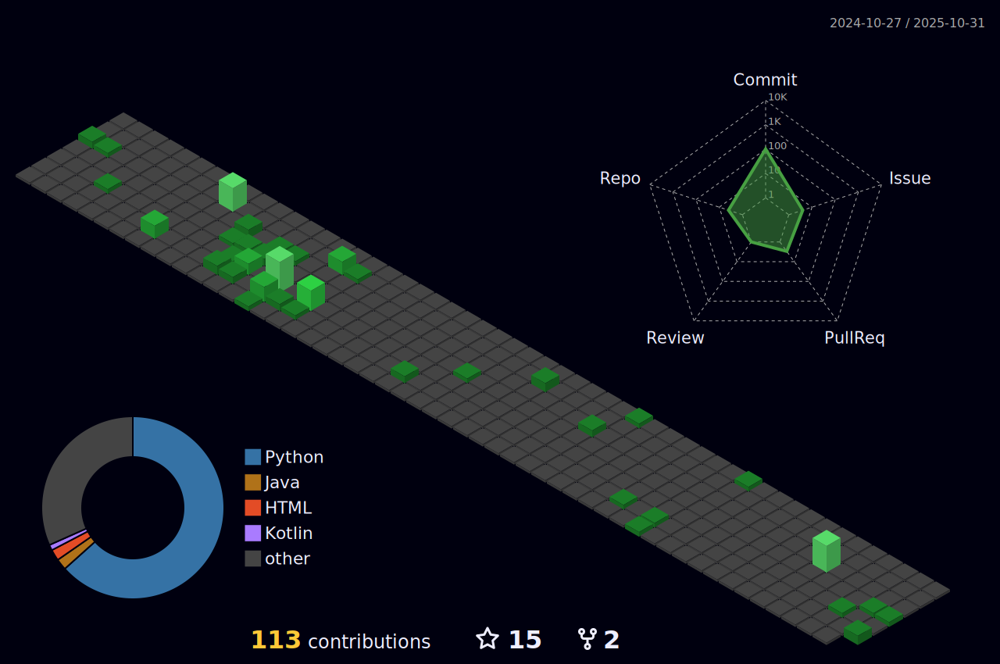

<!-- Top tags -->

  
  
  
  

<image src="https://github.com/user-attachments/assets/b987e741-370e-45a7-8474-a7d17041551b" width=300 height=350 />

<h1 align="center"><a href="http://aimerny.top"> ⛹️‍♂️ WhoAmI </a></h1>

> **一名~~喜欢音游和MC和魔方的~~程序员**
* 🎧 音游相关：**舞萌DX** 🌈15714, **中二节奏** 🐧15.73, **Arcaea** 🌟🌟12.50, **Phigros** 🕊14.80
* 💻 工作方向: 目前从事大数据相关工作
* 🎱 更多标签: 偶尔玩`🚢 Azur Lane`的二次元宅，家里有两只🐈的兢兢业业的铲屎官，三速未sub10的复健中魔方玩家，最近在看key社作品，最喜欢的角色是小狐狸

### 🔧 Tech Stack

### 🍸 Util

### 📫 Social Platform

<h1 align="center">:chart_with_upwards_trend: Working Metrics</a></h1>

  
  
  <a href="https://github.com/aimerny" target="_blank">
    

<!-- profile 3d graph -->
  
 
  
</a>

<!-- Activity Graph -->

